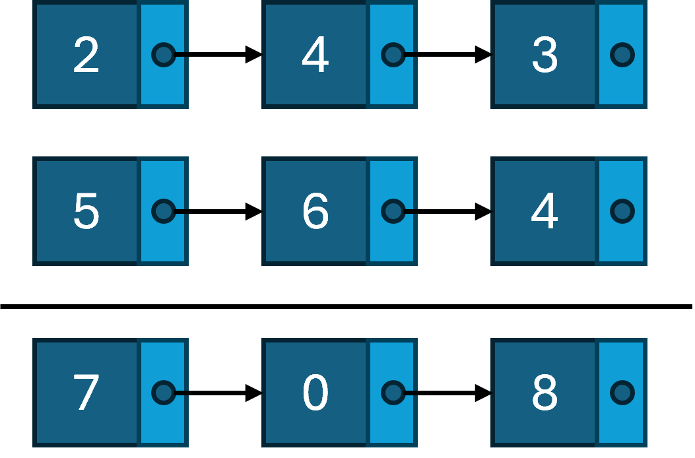

# Taller de Listas Enlazadas

Implementa las soluciones para los siguientes ejercicios.

## 1. Sumar Dos Números
Se te dan dos listas enlazadas no vacías que representan dos 
números enteros no negativos. Los dígitos se almacenan en orden inverso, 
y cada uno de sus nodos contiene un solo dígito. Suma los dos 
números y devuelve la suma como una lista enlazada.

Puedes asumir que los dos números no contienen ningún cero a la izquierda, 
excepto el número 0 en sí mismo.

**Ejemplo 1**:



```
Input: l1 = [2,4,3], l2 = [5,6,4]
Output: [7,0,8]
Explanation: 342 + 465 = 807.
```

**Ejemplo 2**:
```
Input: l1 = [0], l2 = [0]
Output: [0]
```

**Ejemplo 3**:
```
Input: l1 = [9,9,9,9,9,9,9], l2 = [9,9,9,9]
Output: [8,9,9,9,0,0,0,1]
``` 

## 2. Intercambiar Nodos en Pares

Dada una lista enlazada, intercambia cada dos nodos adyacentes. No puedes
modificar los valores en los nodos de la lista. Solo se pueden cambiar los nodos en sí.

**Ejemplo 1**:

```
Input: [1,2,3,4]
Output: [2,1,4,3]
```

**Ejemplo 2**:

```
Input: []
Output: []
```

**Ejemplo 3**:

```
Input: [1]
Output: [1]
```

**Ejemplo 4**:

```
Input: [1,2,3]
Output: [2,1,3]
```

## 3. Ordenar Lista por Inserción

Ordena una lista enlazada usando el ordenamiento por inserción.

Los pasos del algoritmo de ordenamiento por inserción son:

1. El ordenamiento por inserción itera, consumiendo un elemento de entrada en cada 
repetición, y creciendo una lista de salida ordenada.
2. En cada iteración, el ordenamiento por inserción elimina un elemento de los
datos de entrada, encuentra la ubicación a la que pertenece dentro de la lista
ordenada y lo inserta allí.
3. Se repite hasta que no quedan elementos de entrada.

El siguiente es un ejemplo gráfico del algoritmo de ordenamiento por inserción.
La lista parcialmente ordenada (negra) inicialmente contiene solo el primer
elemento de la lista. Un elemento (rojo) se elimina de los datos de entrada
y se inserta en su lugar en la lista ordenada con cada iteración.


**Ejemplo 1**:

```
Input: [4,2,1,3]
Output: [1,2,3,4]
```

**Ejemplo 2**:

```
Input: [-1,5,3,4,0]
Output: [-1,0,3,4,5]
```

## 4. Diseñar Historial del Navegador

Tienes un navegador con una pestaña donde comienzas en la `página de inicio` 
y puedes visitar otra `url`, retroceder en el historial un número de 
`pasos` o avanzar en el historial un número de `pasos`.

Implementa la clase `BrowserHistory`:

- `BrowserHistory(string homepage)` Inicializa el objeto con la 
  página de inicio del navegador.
- `void visit(string url)` Visita `url` desde la página actual. 
  Borra todo el historial hacia adelante.
- `string back(int steps)` Retrocede `steps` en el historial. Si solo puedes 
  retroceder `x` pasos en el historial y `steps > x`, solo retrocederás 
  `x` pasos. Devuelve la `url` actual después de retroceder en el historial 
  como máximo `steps`.
- `string forward(int steps)` Avanza `steps` en el historial. Si solo puedes 
  avanzar `x` pasos en el historial y `steps > x`, solo avanzarás 
  `x` pasos. Devuelve la `url` actual después de avanzar en el historial 
  como máximo `steps`.

**Ejemplo**:

```
Input:
["BrowserHistory", "visit", "visit", "visit", "back", "back", "forward", "visit", "forward", "back", "back"]
[["leetcode.com"], ["google.com"], ["facebook.com"], ["youtube.com"], [1], [1], [1], ["linkedin.com"], [2], [2], [7]]

Output:
[null, null, null, null, "facebook.com", "google.com", "facebook.com", null, "linkedin.com", "google.com", "leetcode.com"]

Explanation:
BrowserHistory browserHistory = new BrowserHistory("leetcode.com");
browserHistory.visit("google.com");       // You are in "google.com". Visit "google.com"
browserHistory.visit("facebook.com");     // You are in "facebook.com". Visit "facebook.com"
browserHistory.visit("youtube.com");      // You are in "youtube.com". Visit "youtube.com"
browserHistory.back(1);                   // You are in "facebook.com", move back to "google.com" return "facebook.com"
browserHistory.back(1);                   // You are in "google.com", move back to "leetcode.com" return "google.com"
browserHistory.forward(1);                // You are in "leetcode.com", move forward to "google.com" return "leetcode.com"
browserHistory.visit("linkedin.com");     // You are in "linkedin.com". Visit "linkedin.com"
browserHistory.forward(2);                // You are in "linkedin.com", you cannot move forward any steps.
browserHistory.back(2);                   // You are in "linkedin.com", move back two steps to "google.com" then to "leetcode.com" return "google.com"
browserHistory.back(7);                   // You are in "google.com", you can move back only one step to "leetcode.com" return "leetcode.com"
```